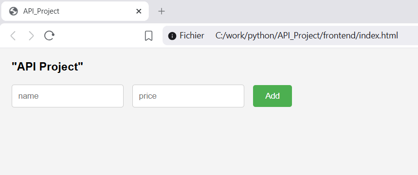
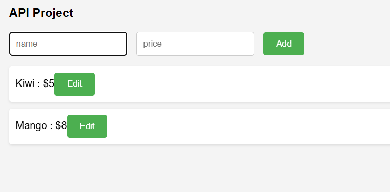
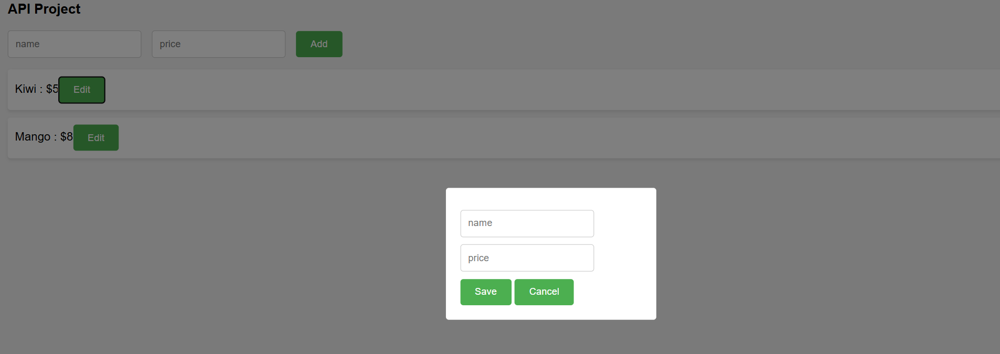

## Project Overview
Simple full-stack app with FastAPI backend and JS frontend.

## Tech Stack
- FastAPI (Python)
- Docker
- GitHub Actions (CI)

## How to run locally

### Without Docker
uvicorn app.main:app --reload

### With Docker
docker build -t my-api .
docker run -p 8000:8000 my-api

## CI
Pipeline runs on every push and:
- installs dependencies
- checks app
- builds Docker image
# API-project

Interface

Editng Items

